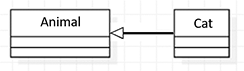
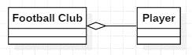
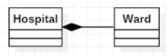

Aggregation
====

###Is-A Relationship

 
A cat *is an* animal.

### Association Relationship

 
A football club *can* contain a player, but a player does not *need* to be in a football club.

### Composition Relationship

 
A hospital *can* have wards, a ward *must* be in a hospital.